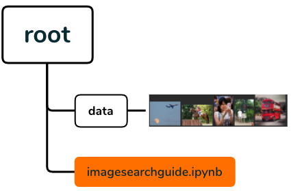

# How to implement text-to-image search on Marqo - in 5 lines of code

*A step-to-step guide on how to search images with text (Text-to-Image Search) using [Marqo](https://www.marqo.ai/).*


[Marqo](https://www.marqo.ai/) is an open-source tensor-based search engine that supports multi-modal search. In this article, we will
introduce how to set up your own text-to-image search engine using marqo. The full code is available on Marqo's github [Github](imagesearchguide.ipynb).

## Set up

### Install marqo
In this article, we select 5 images from the [coco dataset](https://cocodataset.org/#home) as examples.
<p align="center">
  
   
  
   
  
</p>

First, we need to run marqo in docker using the following command. This test is done on a x64 linux machine, for Mac users with M-series chips
please check [here](https://github.com/marqo-ai/marqo#m-series-mac-users).

```
docker rm -f marqo
docker pull marqoai/marqo:0.0.10
docker run --name marqo -it --privileged -p 8882:8882 --add-host host.docker.internal:host-gateway marqoai/marqo:0.0.10
```

Now, we can create a new environment and install the Marqo client by:
```
conda create -n marqo-client python=3.8
conda activate marqo-client

pip install marqo matplotlib
```
Now, open your python and check the installation is successful by:
```python
import marqo
mq = marqo.Client("http://localhost:8882")

mq.get_marqo()
```
and you should have the output as:
```python
{'message': 'Welcome to Marqo', 'version': '0.0.10'}
```
By the time this article is written, we are using marqo with version 0.0.10.

### Download images

Now, you can download our examples images from [Github](./data). You should have the following directory diagram:

<p align="center">
 
</p>


Done, you have finished all the set-up, let do the real search!

## Search with marqo

### Create index

First, we need to create a marqo index that provides you the access to all the necessary operations, e.g., indexing, searching. We also provide
necessary settings based on hardware devices.

```python
index_name = 'image-search-guide'

settings = {
        "model": "ViT-L/14",
        "treat_urls_and_pointers_as_images": True,
        }

mq.create_index(index_name, **settings)
```
__Note__: To accomplish this multi-modal search task, we __MUST__ set `"treat_urls_and_pointers_as_imges": True` to enable the multi-modal search feature. As for the `model`, we need to 
select a model from [__CLIP families__](https://docs.marqo.ai/0.0.10/Models-Reference/dense_retrieval/) (`"ViT-L/14"` in this case).

### Access local images
Now, we need to add the images to the created index, which is a little tricky. Marqo is running in the docker, so it will not be able to access
the local images.
One solution is to upload all the images to Github and access them through urls. This is OK in this case as we only have 5 images. However, if we think big,
are you really going to upload and download 1 million images with a larger dataset? I guess the answer is __NO__, so here is the solution.

We can put the local images in a local server for easier access from marqo in dock by
```python
import subprocess
local_dir = "./data"
pid = subprocess.Popen(['python3', '-m', 'http.server', '8222', '--directory', local_dir], stdout=subprocess.DEVNULL, stderr=subprocess.STDOUT)
```

With this step, marqo can access you image easily using http request, we just need to tell marqo where the image is:
```python
import glob
import os

# Find all the local images
locators = glob.glob(local_dir + '*.jpg')

# Generate docker path for local images
docker_path = "http://host.docker.internal:8222/"
image_docker = [docker_path + os.path.basename(f) for f in locators]

print(image_docker)
```
```python
output:
['http://host.docker.internal:8222/image4.jpg',
 'http://host.docker.internal:8222/image1.jpg',
 'http://host.docker.internal:8222/image3.jpg',
 'http://host.docker.internal:8222/image0.jpg',
 'http://host.docker.internal:8222/image2.jpg']
```

All the local image are on a local server for marqo to access now.

### Add images to index

Marqo requires the input (which we call `documents`) as a `list` of `dictionary`, we can convert the images into the required format

```python
documents = [{"image_docker" : image, "_id" : idx} for idx, image in enumerate(image_docker)]

print(documents)
```
```python
output:
[{'image_docker': 'http://host.docker.internal:8222/image4.jpg', '_id': '0'},
 {'image_docker': 'http://host.docker.internal:8222/image1.jpg', '_id': '1'},
 {'image_docker': 'http://host.docker.internal:8222/image3.jpg', '_id': '2'},
 {'image_docker': 'http://host.docker.internal:8222/image0.jpg', '_id': '3'},
 {'image_docker': 'http://host.docker.internal:8222/image2.jpg', '_id': '4'}]
```

Adding the documents into the previously created index using function `add_documents()`
```python
mq.index(index_name).add_documents(documents, device="cpu", processes=1, client_batch_size= 1)
```
```python
outputs:
2022-12-30 04:27:45,846 logger:'marqo' INFO add_documents pre-processing: took 0.000s for 5 docs, for an average of 0.000s per doc.
2022-12-30 04:27:45,848 logger:'marqo' INFO starting batch ingestion with batch size 1
2022-12-30 04:27:47,130 logger:'marqo' INFO    add_documents batch 0 roundtrip: took 1.281s to add 1 docs, for an average of 1.281s per doc.
2022-12-30 04:27:47,131 logger:'marqo' INFO    add_documents batch 0 Marqo processing: took 1.275s for Marqo to process & index 1 docs (server unbatched), for an average of 1.275s per doc.
2022-12-30 04:27:48,182 logger:'marqo' INFO    add_documents batch 1 roundtrip: took 1.050s to add 1 docs, for an average of 1.050s per doc.
2022-12-30 04:27:48,183 logger:'marqo' INFO    add_documents batch 1 Marqo processing: took 1.045s for Marqo to process & index 1 docs (server unbatched), for an average of 1.045s per doc.
2022-12-30 04:27:49,255 logger:'marqo' INFO    add_documents batch 2 roundtrip: took 1.070s to add 1 docs, for an average of 1.070s per doc.
2022-12-30 04:27:49,256 logger:'marqo' INFO    add_documents batch 2 Marqo processing: took 1.064s for Marqo to process & index 1 docs (server unbatched), for an average of 1.064s per doc.
2022-12-30 04:27:50,386 logger:'marqo' INFO    add_documents batch 3 roundtrip: took 1.129s to add 1 docs, for an average of 1.129s per doc.
2022-12-30 04:27:50,388 logger:'marqo' INFO    add_documents batch 3 Marqo processing: took 1.117s for Marqo to process & index 1 docs (server unbatched), for an average of 1.117s per doc.
2022-12-30 04:27:51,462 logger:'marqo' INFO    add_documents batch 4 roundtrip: took 1.073s to add 1 docs, for an average of 1.073s per doc.
2022-12-30 04:27:51,463 logger:'marqo' INFO    add_documents batch 4 Marqo processing: took 1.067s for Marqo to process & index 1 docs (server unbatched), for an average of 1.067s per doc.
2022-12-30 04:27:51,573 logger:'marqo' INFO completed batch ingestion.
2022-12-30 04:27:51,575 logger:'marqo' INFO add_documents completed. total time taken: 5.729s.
```
Yes, it is just this simple one line of code. And you can check the outputs for the indexing time. Also, you can set `device = "cuda"` if available.

Done, all the images are in the marqo and we can do the search.


### Search
Finally, let us do the search and see the returned the results.

Let's say we want to get the image "*A rider on a horse jumping over the barrier*". Here is the code.
```python
search_results =  mq.index(index_name).search("A rider on a horse jumping over the barrier", 
                        searchable_attributes=['image_docker'], limit = 1,
                        device='cpu')
```
```python
output:
2022-12-30 04:28:56,472 logger:'marqo' INFO search (tensor): took 0.364s to send query and received 1 results from Marqo (roundtrip). Marqo itself took 0.358s to execute the search.
```
Done, we just get the result in 0.36s without the help of GPU! So what does the results look like then?
```python
print(search_results)
```
```python
output:
{'hits': [{'image_docker': 'http://host.docker.internal:8222/image1.jpg',
   '_id': '1',
   '_highlights': {'image_docker': 'http://host.docker.internal:8222/image1.jpg'},
   '_score': 0.6133688}],
 'processingTimeMs': 358,
 'query': 'A rider on a horse jumping over the barrier',
 'limit': 1}
```
Well, very hard to understand? Don't worry, let's plot it and verify it by your eyes:
```python
import requests
from PIL import Image

fig_path = search_results["hits"][0]["image_docker"].replace(docker_path, local_dir)
display(Image.open(fig_path))
```
output:
<p align="center">
    
</p>

Isn't this the image you are look for, "*A rider on a horse jumping over the barrier*"? Searching image using text is just so simple.
You must be thinking this is 5 images. What will happen in a larger dataset?
Why not try it yourself, you can easily __change the parameters in the code__, __add more images into the directory__, and __test your searching results__.
You can also check other advanced usages in our [Github](https://github.com/marqo-ai/marqo).

## Take aways

It is really easy to use marqo to achieve multi-modal searching, e.g., image-to-text, text-to-image, image-to-image, with the following steps:

1. Environment setup. 
2. Create index. 
3. Add images into the index.
4. Search.

