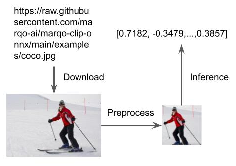
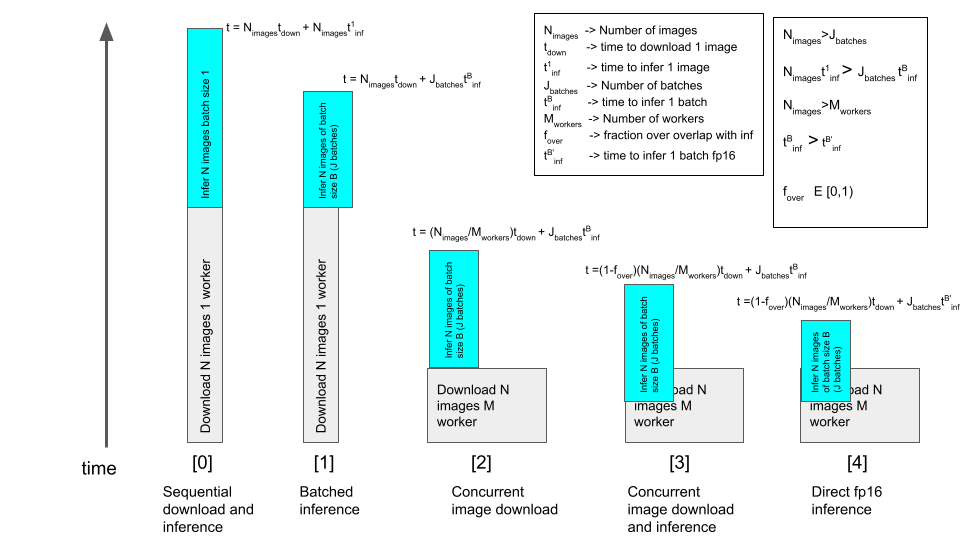
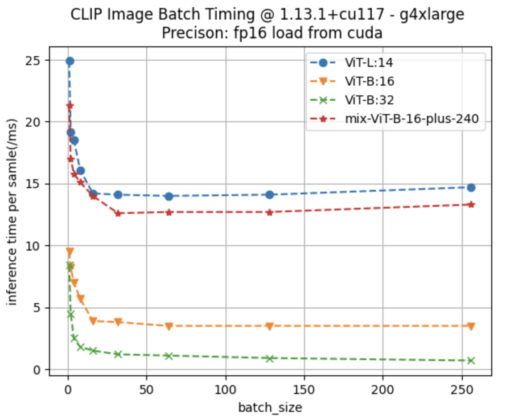
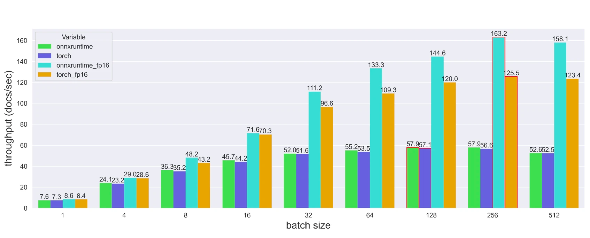

# Marqo: How we increase the speed

*In this article, we tell the story of how engineers in [Marqo](https://www.marqo.ai/) increase the inference speed in the index stage. We
give our recommendations on how to choose the best model with expected throughput and search accuracy.
We also open source a useful package that can converts clip models into onnx versions.
[Marqo](https://www.marqo.ai/) is
a tensor-based search and analytics engine that seamlessly integrates with applications and websites.*

Imagine what you can do in 200 milliseconds, blinking your eyes once, or clicking your mouse once? 
In the same amount of time, Marqo needs to finish 1 search and return the results to you or add 10 images into
the index for future search. Let's get into this eye-blinking process and see how we achieve this.

## Introduction
When you want to build your own search engine with Marqo, the first step you should do is to add documents into an index, and
we call this process *__index__*. If we use images as examples, you may want to add thousands or even millions of images into
the index. Throughput describes the number of images that can be added into our index in a certain amount of time. Increasing the throughput is 
what we aim for.

While 1 million is too large, let's take one image as an example and see its life in Marqo.
In Marqo, each image starts as a downloadable url address and ends up as a tensor. Marqo will **download** the image, **preprocess** the image,
**inference** the image using neural network models (CLIP models), and **store** it in the storage. The figure below describes the whole process.

    
     
    <em>The life of an image in Marqo.</em>

Now the question is, *if we have 1 million images, should we just multiply the time for 1 image by 1 million?* The answer is **NO** for Marqo.
Our engineers use the following diagram to model the index process.

    
     
    <em>The throughput diagram of the index process in Marqo.</em>

Don't be scared by the equations in the figure. All we want is to **download the images concurrently**, **batch the inference
preprocess**, and **choose the right model** to boost your index speed.

## Concurrent Image Downloading
Concurrent image downloading can improve the image fetching speed by an order of magnitude compared with sequential downloading.
In Marqo's recent [release 0.0.12](https://github.com/marqo-ai/marqo/releases/tag/0.0.12), we added this feature. 
The table below looks at the time that different numbers of workers take to download and CLIP preprocess 128 images.
The average time it takes for each image is reduced by more than 10 times. In Marqo, we choose the number of workers as 20
, and we see a **4 times** throughput increase with concurrent image downloading.

| number of workers | average time per image(s) | total time(s) |
|-------------------|---------------------------|---------------|
| 0                 | 0.930420                  | 119.094125    |
| 2                 | 0.467580                  | 59.858550     |
| 4                 | 0.234280                  | 29.998236     |
| 16                | 0.061620                  | 7.901435      |

## Batch Inference
Batch inference can increase the throughput compared with single sequential inference. In general, we would like to increase
the batch size until throughput decreases. For all the different models in Marqo, the optimal batch size is indefinite. We test 
the throughput of different models on AWS g4dn.xlarge instance with a NVIDIA T4 gpu. The per sample inference time v.s. batch size results
are shown as below:

    
     
    <em>The throughput test of different clip models on g4dn.xlarge instance.</em>

Although different models have different throughputs due to the architecture of the neural networks, they all benefit from
the batching strategy. For example, the per sample inference time for the model **ViT-B-32** reduced from 8ms to 2ms, which 
indicates a 4 times throughput increase. In Marqo, the concurrently downloaded images are batched and then passed into the 
inference model, which leads to a **2** to **4** times throughput increases (depending on models and hardware specifications).

## Model Selection
In Marqo, we use CLIP models to embed images into tensors for search purposes. A full list of available models in Marqo can be 
found [here](https://docs.marqo.ai/0.0.12/Models-Reference/dense_retrieval/). Different models are trained 
by [OpenAI](https://github.com/openai/CLIP) and [Open CLIP](https://github.com/mlfoundations/open_clip) in PyTorch forms.
We recommend users to select the model based on a [benchmark repo](https://github.com/LAION-AI/CLIP_benchmark). 

For OpenAI models, we also provide the `fast` option. These models implement the computation in `float16` precision, which
reduces the inference time by half with a minor loss to accuracy. This is a very good option if you need to add a lot of images
in a short time while the accuracy can be compromised.

We also open source our [*marqo-clip-onnx*](https://github.com/marqo-ai/marqo-clip-onnx) package here. This package can
convert both OpenAI CLIP models and Open CLIP models to onnx versions, in both float32 precision and float16 precision.
Onnx models have improved throughput compared with PyTorch models. The image below compares the throughput of onnx models and torch models 
in different precisions and batch sizes.

    
     
    <em>Throughput comparison for onnx models and torch models in fp16 and fp32.</em>

We can tell from the figure that onnx models have increased throughput, especially in fp16 precision. Marqo supports
all types of models in different precisions for you to choose from. However, please be noted that fp16 models have degraded
performance.

## Takeaways

In Marqo's recent [release 0.0.12](https://github.com/marqo-ai/marqo/releases/tag/0.0.12), we focus on increasing the throughput of the system.

- We use currently **image downloading**, **batch inference** to increase the system throughput.
- We support all CLIP models with different precisions to further boost your inference speed.
- We open source our [*marqo-clip-onnx*](https://github.com/marqo-ai/marqo-clip-onnx) package that can converts CLIP models to onnx versions.

