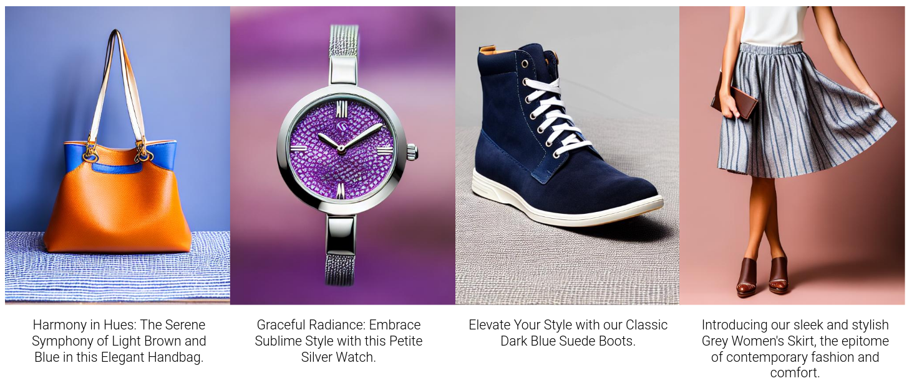
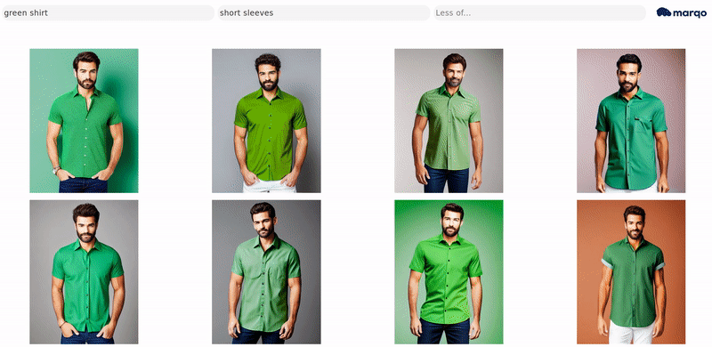
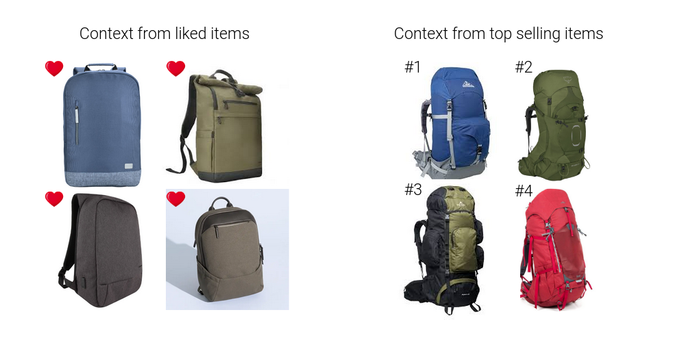
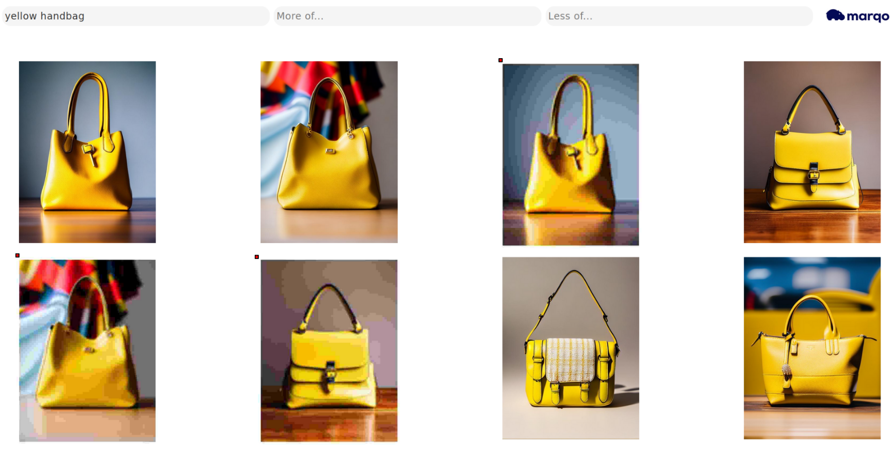
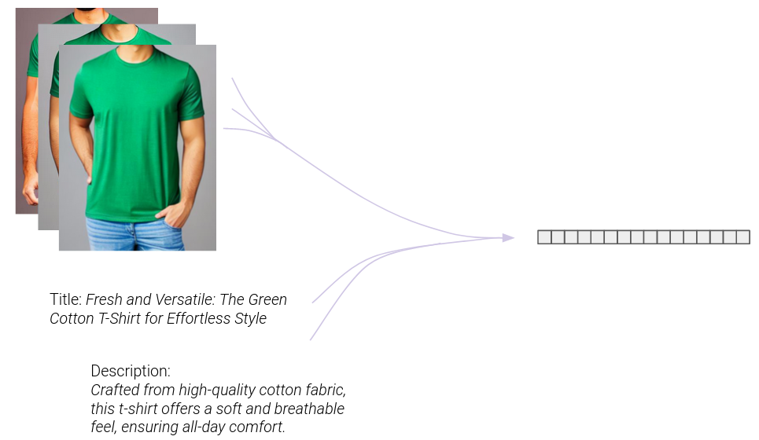

# “Context Is All You Need” - Multi-Modal Vector Search with Personalization 

*TL:DR We show how both text and images can be used for multi-modal search. This allows for multi-part queries, multi-modal queries, searching via prompting, promoting/suppressing content by themes, per query curation and personalization. Additionally, we show how other query independent signals can be used to rank documents in addition to similarity. These features allow the creation and curation of high-quality search experiences, particularly for e-commerce and image heavy applications. The article [contains many examples](https://github.com/marqo-ai/marqo/tree/mainline/examples/GPT-examples) of multi-modal search and the [code](https://github.com/marqo-ai/marqo/blob/mainline/examples/MultiModalSearch/index_and_search.py) to reproduce these.*

<p align="center">
  
</p>
<p align="center">
    <em>An example of multi-modal search that uses multi-modal queries to curate search results based on text and images.</em>
</p>

## 1. Introduction

Often the items we want to search over contain more than just text. For example, they may also contain images or videos. These modalities other than text will often contain a wealth of information that is not captured by the text. By incorporating these other modalities into search, the relevancy of results can be improved as well as unlocking new ways to search. Examples of multi-modal search include domains like fashion and e-commerce which may have title, description as well as multiple images displaying the item. This data can also help disambiguate the subject of the image - for example if there are multiple items present like pants and a top, the text can provide the necessary context to identify the correct subject. The information contained in these data across modalities is complementary and rich. 

This articles has three main parts:
1. Introduction to multi-modal search.
2. Examples of Multi-modal search.
3. Complete code to reproduce the examples.

<p align="center">
  
</p>
<p align="center">
    <em>An example of multi-modal "document" that contain both images and text.</em>
</p>

### 1.1 Multi-Modal Search

Multi-modal search is search that operates over multiple modalities. We can think of two ways of doing multi-modal search, using multi-modal queries and multi-modal documents. In both cases, they may contain any combination of text and images. For clarity we will stick to two modalities for now, text and images but the concepts are not restricted to just those and can be extended to video or audio (for example).

<p align="center">
  
</p>
<p align="center">
    <em>An example of multi-modal search using images and text to refine a search.</em>
</p>

### 1.2 Benefits

There are numerous benefits to this multi-modal approach. For example:

- The mulit-modal representations of documents allows for utilizing not just text or images or a combination of these. This allows complementary information to be captured that is not present in either modality.
- Using multi-modal representations allows for updatable and editable meta data for documents without re-training a model or re-indexing large amounts of data.
- Relevance feedback can be easily incorporated at a document level to improve or modify results.
- Curating queries with additional context allows for personalization and curation of results on a per query basis without additional models or fine-tuning.
- Curation can be performed in natural language.
- Business logic can be incorporated into the search using natural language.

## 2. Multi-modal Search in Practice

In this section we will walk through a number of ways multi-modal search can be used to improve and curate results.

### 2.1 Multi-Modal Queries

Multi-modal queries are queries that are made up of multiple components and/or multiple modalities. The benefit is that it effectively allows us to modify the scoring function for the approximate-knn to take into account additional similarities - for example, across multiple images or text and images.  The similarity scoring will now be against a weighted collection of items rather than a single piece of text. This allows finer grained curation of search results than by using a single part query alone.  We have seen previous examples of this earlier in the article already where both images and text are used to curate the search.

Shown below is an example of this where the query has multiple components. The first query is for an item while the second query is used to further condition the results. This acts as a “soft” or “semantic” filter. 

```python
query = {"green shirt":1.0, "short sleeves":1.0}
```

This multi-part query can be understood to be a form of manual [query expansion](https://en.wikipedia.org/wiki/Query_expansion). The animation below illustrates how the query can be used to modify search results.

<p align="center">
  
</p>
<p align="center">
    <em>An example of multi-modal search two text queries to further refine the search.</em>
</p>


### 2.2 Negation

In the previous examples we saw how multiple queries can be used to condition the search. In those examples, the terms were being added with a positive weighting. Another way to utilise these queries is to use negative weighting terms to move away from particular terms or concepts. Below is an example of a query with an additional negative term:

```python
query = {"green shirt":1.0, "short sleeves":1.0, "buttons":-1.0}
```

Now the search results are also moving away from the `buttons` while being drawn to the `green shirt` and `short sleeves`.

<p align="center">
  
</p>
<p align="center">
    <em>An example of multi-modal search using negation to avoid certain concepts - `buttons` in this case.</em>
</p>


### 2.3 Excluding Low Quality Images

Negation can help avoid particular things when returning results, like low-quality images or ones with artifacts. Avoiding things like low-quality images or [NSFW content](https://www.marqo.ai/blog/refining-image-quality-and-eliminating-nsfw-content-with-marqo) can be easily described using natural language as seen in the example query below:

```python
query = {"yellow handbag":1.0, "lowres, blurry, low quality":-1.1}
```

In the example below the initial results contain three low-quality images. These are denoted by a red mark for clarity and the poor image quality can be seen by the strong banding in the background of these images. 

<p align="center">
  
</p>
<p align="center">
    <em>An example of multi-modal search using negation to avoid low quality images. The low-quality images are denoted by a red dot next to them. </em>
</p>

An alternative is to use the same query to clean up existing data by using a positive weight to [actively identify low-quality images](https://www.marqo.ai/blog/refining-image-quality-and-eliminating-nsfw-content-with-marqo) for removal. 

### 2.4 Searching with Images

In the earlier examples we have seen how searching can be performed using weighted combinations of images and text. Searching with images alone can also be performed to utilize image similarity to find similar looking items. An example query is below:

```python
query = {image_url:1.0}
```

It can also be easily extended in the same way as with text to include multiple multi-modal terms.

```python
query = {image_url:1.0, "RED":1.0}
```

<p align="center">
  
</p>
<p align="center">
    <em>An example of multi-modal search using an image as the query before refining the search further with natural language. </em>
</p>

### 2.5 Conditional Search with Popular or Liked Items

Another way to utilize the multi-modal queries is to condition the query using a set of items. For example, this set could come from previously liked or purchased items. This will steer the search in the direction of these items and can be used to promote particular items or themes. This method can be seen as a form of [relevance feedback](https://en.wikipedia.org/wiki/Rocchio_algorithm) that uses items instead of variations on the query words themselves. To avoid any extra inference at search time, we can pre-compute the set of items vectors and fuse them into a context vector. 

```python
query = {"backpack":1.0}                      			  query = {"backpack":1.0}
context_vector1 = [.1, ...,.-.8]               		 	  context_vector2 = [-.01, ...,.3]
```

Below is an example of two sets of 4 items that are going to be used to condition the search. The contribution for each item can also be adjusted to reflect the magnitude of its popularity. 

<p align="center">
  
</p>
<p align="center">
    <em>Two sets of items based on different relevance feedback mechanisms that can be used to curate the search.</em>
</p>

<p align="center">
  
</p>
<p align="center">
    <em>Two results sets for identical queries that were conditioned on two different sets of items. The search results are aligned with their conditioning.</em>
</p>


### 2.6 Searching as Prompting

An alternative method to constructing multi-part queries is to append specific characteristics or styles to the end of a query. This is effectively the same as "prompting" in text to image generation models like [DALLE](https://openai.com/research/dall-e) and [Stable Diffusion](https://github.com/CompVis/stable-diffusion). For example, additional descriptors can be appended to a query to curate the results. An example query with additional prompting is below:

```python 
query = {"handbag, bold colors, vibrant":1.0}
```

The impact of this prompting on the results can be seen in the animation.

<p align="center">
  
</p>
<p align="center">
    <em>Results that are curated with prompting.</em>
</p>

Another example query of searching as prompting:

```python
query = {"cozy sweater, xmas, festive, holidays":1.0}
```

<p align="center">
  
</p>
<p align="center">
    <em>Results that are curated with prompting.</em>
</p>


### 2.7 Ranking with Other Signals

In addition to curating the search with the methods outlined above, we can modify the similarity score to allow ranking with other signals. For example document specific values can be used to multiply or bias the vector similarity score. This allows for document specific concepts like overall popularity to impact the ranking.  Below is the regular query and search results based on vector similarity alone:

```python
query = {"yellow handbag":1.0}
```

<p align="center">
  
</p>
<p align="center">
    <em>Results that are based on similarity alone.</em>
</p>

To illustrate the ability to modify the score and use other signals for ranking we have calculated an [aesthetic score](https://github.com/LAION-AI/aesthetic-predictor) for each item. The aesthetic score is meant to identify "aesthetic" images and rate them between 1 and 10. We can now bias the score using this document (but query independent) field. An example is below:

```python
query = {"yellow handbag":1.0}
score_modifiers = { 
        "add_to_score": 
            [
              {"field_name": "aesthetic_score", "weight": 0.02}]
       }
```

<p align="center">
  
</p>
<p align="center">
    <em>Results that are based on similarity and aesthetic score.</em>
</p>

In the image above, the results have now been biased by the aesthetic score to remove the low-quality images (which have a low aesthetic score). This example uses aesthetic score but any other number of scalars can be used - for example ones based around sales and/or popularity. 


### 2.8 Multi-Modal Entities

Multi modal entities or items are just that - representations that take into account multiple pieces of information. These can be images or text or some combination of both. Examples include using multiple display images for ecommerce. Using multiple images can aid retrieval and help disambiguate between the item for sale and other items in the images. If a multi-modal model like CLIP is used, then the different modalities can be used together as they live in the same latent space.

```python
document = {"combined_text_image": 
		         {
                "image1":"https://some_image1.png",
		"image2":"https://some_image2.png",
		"image3":"https://some_image3.png", 
		"title": "Fresh and Versatile: The Green Cotton T-Shirt for Effortless Style"
		"description": "Crafted from high-quality cotton fabric, this t-shirt offers a soft and breathable feel, ensuring all-day comfort."
			  }
	    }
```

<p align="center">
  
</p>


## 3. Detailed Example

In the next section we will demonstrate how all of the above concepts can be implemented using [Marqo](https://github.com/marqo-ai/marqo).

### 3.1 Dataset

The dataset consists of ~220,000 e-commerce products with images, text and some meta-data. The items span many categories of items, from clothing and watches to bags, backpacks and wallets. Along with the images they also have an [aesthetic score](https://github.com/LAION-AI/aesthetic-predictor), caption, and price. We will use all these features in the following example. Some images from the dataset are below.

<p align="center">
  
</p>
<p align="center">
    <em>Some example images from the dataset.</em>
</p>


### 3.2 Installing Marqo

The first thing to do is start [Marqo](https://github.com/marqo-ai/marqo). To start, we can run the following [docker command](https://marqo.pages.dev/0.0.21/) from a terminal (for M-series Mac users see [here](https://marqo.pages.dev/0.0.21/m1_mac_users/)).

```bash
docker pull marqoai/marqo:latest
docker rm -f marqo
docker run --name marqo -it --privileged -p 8882:8882 --add-host host.docker.internal:host-gateway marqoai/marqo:latest
```

The next step is to install the python client (a REST API is also [available](https://docs.marqo.ai/0.0.21/)).

```bash
pip install marqo
```

### 3.3 Loading the Data

The first step is to load the data. The images are hosted on s3 for easy access. We use a file that contains all the image pointers as well as the meta data for them (found [here](https://marqo-overall-demo-assets.s3.us-west-2.amazonaws.com/ecommerce_meta_data.csv)). 

```python
import pandas as pd

N = 100 # samples to use, the full dataset is ~220k
filename = "https://marqo-overall-demo-assets.s3.us-west-2.amazonaws.com/ecommerce_meta_data.csv"
data = pd.read_csv(filename, nrows=N)
data['_id'] = data['s3_http']
documents = data[['s3_http', '_id', 'price', 'blip_large_caption', 'aesthetic_score']].to_dict(orient='records')
```

###  3.4 Create the Index

Now we have the data prepared, we can [set up the index](https://marqo.pages.dev/0.0.21/API-Reference/indexes/). We will use a ViT-L-14 from open clip as the model. This model is very good to start with. It is recommended to [use a GPU](https://marqo.pages.dev/0.0.21/using_marqo_with_a_gpu/) (at least 4GB VRAM) otherwise a [smaller model](https://marqo.pages.dev/0.0.21/Models-Reference/dense_retrieval/#open-clip) can be used (although results may be worse).  

```python
from marqo import Client

client = Client()
    
index_name = 'multimodal'
settings = {
            "index_defaults": {
                "treat_urls_and_pointers_as_images": True,
                "model": "open_clip/ViT-L-14/laion2b_s32b_b82k",
                "normalize_embeddings": True,
            },
        }
    
response = client.create_index(index_name, settings_dict=settings)
```

###  3.5 Add Images to the Index

Now we can [add images](https://marqo.pages.dev/0.0.21/API-Reference/documents/) to the index which can then be searched over. We can also select the device we want to use and also which fields in the data to embed. To use a GPU, change the device to `cuda` (see [here](https://marqo.pages.dev/0.0.21/using_marqo_with_a_gpu/) for how to use Marqo with a GPU).

```python
device = 'cpu' # use 'cuda' if a GPU is available
non_tensor_fields = ['_id', 'price', 'blip_large_caption', 'aesthetic_score']

res = client.index(index_name).add_documents(documents, client_batch_size=64, non_tensor_fields=non_tensor_fields, device=device)
```

###  3.6 Searching

Now the images are indexed, we can start [searching](https://marqo.pages.dev/0.0.21/API-Reference/search/).

```python
query = "green shirt"
res = client.index(index_name).search(query, searchable_attributes=['s3_http'], device=device, limit=10)
```

###  3.7 Searching as Prompting

Like in the examples above, it is easy to do more specific searches by adopting a similar style to prompting. 

```python
query = "cozy sweater, xmas, festive, holidays"    
res = client.index(index_name).search(query, searchable_attributes=['s3_http'], device=device, limit=10)
```

###  3.8 Searching with Semantic Filters

Now we can extend the searching to use multi-part queries. These can act as "semantic filters" that can be based on any words to further refine the results.

```python
query = {"green shirt":1.0, "short sleeves":1.0}
res = client.index(index_name).search(query, searchable_attributes=['s3_http'], device=device, limit=10)
```

###  3.9 Searching with Negation

In addition to additive terms, negation can be used. Here we remove buttons from long sleeve shirt examples.

```python
query = {"green shirt":1.0, "short sleeves":1.0, "buttons":-1.0}
res = client.index(index_name).search(query, searchable_attributes=['s3_http'], device=device, limit=10)
```

###  3.10 Searching with Images

In addition to text, searching can be done with images alone. 

```python
image_context_url = "https://marqo-overall-demo-assets.s3.us-west-2.amazonaws.com/ecommerce/red_backpack.jpg"
query = {image_context_url:1.0}
res = client.index(index_name).search(query, searchable_attributes=['s3_http'], device=device, limit=10)
```

###  3.11 Searching with Multi-Modal Queries

The multi-part queries can span both text and images. 

```python
# skateboard
image_context_url = "https://marqo-overall-demo-assets.s3.us-west-2.amazonaws.com/ecommerce/71iPk9lfhML._SL1500_.jpg"

query = {"backpack":1.0, image_context_url:1.0}
res = client.index(index_name).search(query, searchable_attributes=['s3_http'], device=device, limit=10)

# trees/hiking
image_context_url = "https://marqo-overall-demo-assets.s3.us-west-2.amazonaws.com/ecommerce/trees.jpg"

query = {"backpack":1.0, image_context_url:1.0}
res = client.index(index_name).search(query, searchable_attributes=['s3_http'], device=device, limit=10)
```

###  3.12 Searching with Ranking

We can now extend the search to also include document specific values to boost the [ranking of documents](https://marqo.pages.dev/0.0.21/API-Reference/search/#score-modifiers) in addition to the vector similarity. In this example, each document has a field called `aesthetic_score` which can also be used to bias the score of each document.

```python
query = {"yellow handbag":1.0}
    
# we define the extra document specific data to use for ranking
# multiple fields can be used to multiply or add to the vector similarity score
score_modifiers = { 
        "add_to_score": 
            [
            {"field_name": "aesthetic_score", "weight": 0.02}]
        }
    
res = client.index(index_name).search(query, searchable_attributes=['s3_http'], device=device, limit=10, score_modifiers=score_modifiers)

# now get the aggregate aesthetic score
print(sum(r['aesthetic_score'] for r in res['hits']))
    
# and compare to the non ranking version
res = client.index(index_name).search(query, searchable_attributes=['s3_http'], device=device, limit=10)

print(sum(r['aesthetic_score'] for r in res['hits']))
```

###  3.13 Searching with Popular or Liked Products

Results at a per-query level can be personalized using sets of items. These items could be previously liked or popular items. To perform this we do it in two stages. The first is to calculate the "context vector" which is a condensed representation of the items. This is pre-computed and then stored to remove any additional overhead at query time. The context is generated by [creating documents](https://marqo.pages.dev/0.0.21/Advanced-Usage/document_fields/#multimodal-combination-object) of the item sets and retrieving the corresponding vectors. 
The first step is to create a new index to calculate the context vectors.
```python
# we create another index to create a context vector
index_name_context = 'multimodal-context'
settings = {
            "index_defaults": {
                "treat_urls_and_pointers_as_images": True,
                "model": "open_clip/ViT-L-14/laion2b_s32b_b82k",
                "normalize_embeddings": True,
            },
        }
    
res = client.create_index(index_name_context, settings_dict=settings)
```

Then we [construct the objects](https://marqo.pages.dev/0.0.21/Advanced-Usage/document_fields/#multimodal-combination-object) from the sets of items we want to use for the context.

```python
# create the document that will be created from multiple images
document1 = {"_id":"1",
                "multimodal": 
                    {
                        "top_1":"https://marqo-overall-demo-assets.s3.us-west-2.amazonaws.com/ecommerce/blue_backpack.jpg", 
                        "top_2":"https://marqo-overall-demo-assets.s3.us-west-2.amazonaws.com/ecommerce/dark_backpack.jpeg", 
                        "top_3":'https://marqo-overall-demo-assets.s3.us-west-2.amazonaws.com/ecommerce/green+_backpack.jpg',
                        "top_4":"https://marqo-overall-demo-assets.s3.us-west-2.amazonaws.com/ecommerce/red_backpack.jpg"
                    }
               }

# create the document that will be created from multiple images
document2 = {"_id":"2",
                "multimodal": 
                    {
                        "top_1":"https://marqo-overall-demo-assets.s3.us-west-2.amazonaws.com/ecommerce/office_1.jpg", 
                        "top_2":"https://marqo-overall-demo-assets.s3.us-west-2.amazonaws.com/ecommerce/office2.webp", 
                        "top_3":'https://marqo-overall-demo-assets.s3.us-west-2.amazonaws.com/ecommerce/office_3.jpeg',
                        "top_4":"https://marqo-overall-demo-assets.s3.us-west-2.amazonaws.com/ecommerce/office_4.jpg"
                    }
               }

```

We can now [define mappings](https://marqo.pages.dev/0.0.21/API-Reference/mappings/) objects to determine how we want to combine the different fields. We can then index the documents.

```python
# define how we want to combined
mappings1 = {"multimodal": 
               {"type": "multimodal_combination",
                   "weights": {"top_1": 0.40,
                               "top_2": 0.30,
                               "top_3": 0.20,
                               "top_4": 0.10,
                            }}}

# define how we want to combined
mappings2 = {"multimodal": 
               {"type": "multimodal_combination",
                   "weights": {"top_1": 0.25,
                               "top_2": 0.25,
                               "top_3": 0.25,
                               "top_4": 0.25,
                            }}}

# index the document             
res = client.index(index_name_context).add_documents([document1], device=device, mappings=mappings1)
    
# index the other using a different mappings
res = client.index(index_name_context).add_documents([document2], device=device, mappings=mappings2)
```

To get the vectors to use as context vectors at search time - we need to [retrieve the calculated vectors](https://marqo.pages.dev/0.0.21/API-Reference/documents/). We can then [create a context object](https://marqo.pages.dev/0.0.21/API-Reference/search/#context) that is used at search time.

```python

# retrieve the embedding to use as a context for search
indexed_documents = client.index(index_name_context).get_documents([document1['_id'], document2['_id']] , expose_facets=True)
    
# get the embedding
context_vector1 = indexed_documents['results'][0]['_tensor_facets'][0]['_embedding']
context_vector2 = indexed_documents['results'][1]['_tensor_facets'][0]['_embedding']
    
# create the context for the search
context1 = {"tensor":
                [
                  {'vector':context_vector1, 'weight':0.50}                  
                ]
            }

# create the context for the search
context2 = {"tensor":
                [
                  {'vector':context_vector2, 'weight':0.50}                  
                ]
            }

# now search
query = {"backpack":1.0}
res1 = client.index(index_name).search(query, searchable_attributes=['s3_http'], device=device, limit=10, context=context1)
    
res2 = client.index(index_name).search(query, searchable_attributes=['s3_http'], device=device, limit=10, context=context2)
```

###  3.14 Indexing as Multi-Modal Objects

For the final part of this example, we demonstrate how both text and images can be combined together as a single entity and allow multi-modal representations.
We will create a new inex in the same way as before but with a new name.

```python
# we will create a new index for the multimodal objects
index_name_mm_objects = 'multimodal-objects'
settings = {
            "index_defaults": {
                "treat_urls_and_pointers_as_images": True,
                "model": "open_clip/ViT-L-14/laion2b_s32b_b82k",
                "normalize_embeddings": True,
            },
        }
    
res = client.create_index(index_name_mm_objects, settings_dict=settings) 
```
 
 To index the documents as multi-modal objects, we need to create a new field and add in what we want to use. 
    
 ```python
 # now create the multi-modal field in the documents
 for doc in documents:
     doc['multimodal'] = {
                            'blip_large_caption':doc['blip_large_caption'],
                            's3_http':doc['s3_http'],
                            }
```

The next step is to index. The only change is an additional mappings object which details how we want to combine the different fields for each document.

```python
# the fields we do not want to embed
non_tensor_fields = ['_id', 'price', 'blip_large_caption', 'aesthetic_score', 's3_http']

# define how we want to combine the fields
mappings = {"multimodal": 
                         {"type": "multimodal_combination",
                          "weights": 
                             {"blip_large_caption": 0.20,
                               "s3_http": 0.80,
                             }
                         }
                }
    
# now index
res = client.index(index_name_mm_objects).add_documents(documents, client_batch_size=64, non_tensor_fields=non_tensor_fields, device=device, mappings=mappings)
```

Finally we can search in the same way as before. 

```python
query = "red shawl"
res = client.index(index_name_mm_objects).search(query, searchable_attributes=['multimodal'], device=device, limit=10)
```

### 4. Conclusion

To summarise, we have shown how vector search can be easily modified to enable a number of useful functions. These include the use of multi-modal queries that comprise text and images, queries with negative terms, excluding low quality images, searching with images, per query search curation using popular items, verbose searching via prompting, ranking with external scalars and multi-modal representations. If you are interested in learning more, then head to [Marqo](https://github.com/marqo-ai/marqo), see other [examples](https://github.com/marqo-ai/marqo/tree/mainline/examples) or read more in our [blog](https://www.marqo.ai/blog). 


