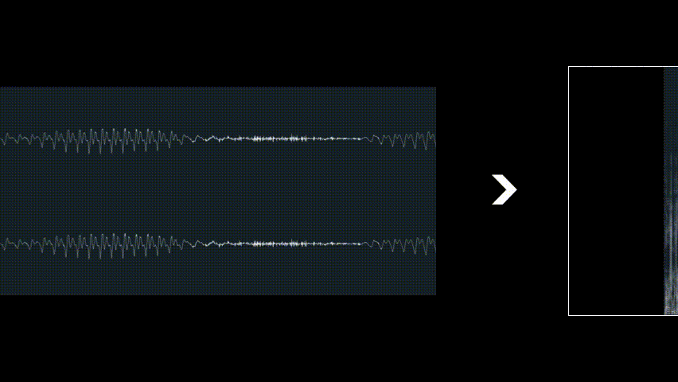
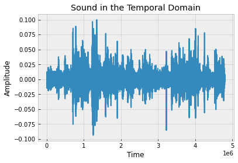
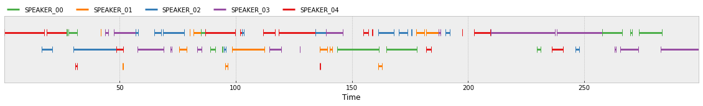
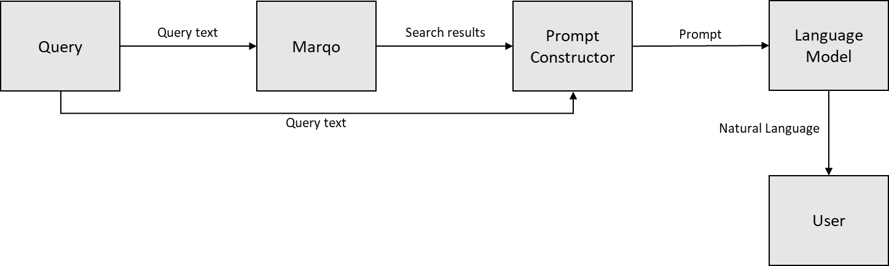

# After All is Said and Indexed - Unlocking Information in Recorded Speech

Speech is one of the most popular forms of communication and much of the world’s data is held in audio recordings of human speech, whether it be as videos, movies, TV, phone calls, meeting recordings and more. While abundant in nature, accessing the content of speech data is a difficult task, making it searchable is even harder.

In this article we present a system which extracts audio from online sources, identifies speakers, transcribes their speech, indexes them into Marqo and then uses the resulting Marqo index as a source of truth to respond to questions about the content. We demonstrate the behaviour of this system by ingesting a diverse dataset from three distinct domains and then asking very domain specific questions to a chatbot provided context retrieved with Marqo.


## The challenges of working with Audio

The task of searching audio is a challenging problem. In the world of AI, audio is an especially challenging medium to work with due to its high dimensionality and its obfuscation of useful features when represented as a waveform in the time domain. The human ear can hear sounds up to around 20,000 Hz, this requires a sample rate of 40,000 Hz to represent; given that the average English speaker in the US speaks at a speed of 2.5 words per second some back of the napkin maths says that it requires an average of 16,000 floating point numbers to represent a single word at the fidelity required to match the human ear (in the time domain).

In practice this large dimensionality problem is made more palatable by down-sampling the audio, we accept a loss in quality in exchange for more manageable data. Down-sampling to a 16,000 Hz sample rate using the numbers discussed before gives us a more manageable (but still large) average of 6,400 floating point numbers per word.

Many AI systems do not operate directly on the waveform and instead transform windows of the wavefrom into the frequency domain to generate a spectogram, this involves converting chunks of the signal into the frequency domain with fast fourier transforms as depicted below.



## Applications for Searching Speech Data

For the avid users of Marqo you may have come across [our podcast demo](https://docs.marqo.ai/latest/End-to-End%20Examples/simple_podcast_demo/). This was an inspiration for this project. 

There are many applications for searchability of speech in commercial platforms, enterprise and industry.

For platforms that run podcasts or host videos this approach could be used to enhance the retrieval of relevant search results - removing a reliance on metadata tagging, search results can include a snippet of the media as well as time stamps to reduce their need to navigate through and scrub over the media looking for a specific section.

In an enterprise context this technology can be used to index recordings of meetings to provide organisations with a new capability, the retrieval, attribution and traceability of decision points. Speaker diarisation works much better when the number of speakers is known ahead of time; this could be extracted by integrating with meeting software to monitor concurrent speakers throughout the meeting, speaker names from the meeting can also be mapped to the transcribed sections and indexed.

The traceability capability extends to industry applications. Indexing and archiving live communications data means that operational decisions can be later retrieved - this can be invaluable to posteriori analysis of decision making that led to a an outcome, whether that be an incident or a success.

## Audio and Marqo

Currently Marqo doesn’t support audio and instead only has support for images and text. 

As such this article discusses the process of building a speech processing front end that wrangles audio data into documents which can be indexed by Marqo. The process can be broken into the following steps which will be discussed in more detail in subsequent sections:

- Ingestion
- Speaker diarisation & speech to text
- Indexing
- Searching and information retrieval

The full source code that is referred to in the article can be found [here](https://github.com/OwenPendrighElliott/AudioSearching)

## Ingestion

The downloader can ingest audio from a variety of sources, including YouTube videos, links to audio files and local files. The AudioWrangler class provides a number of methods for downloading and wrangling audio.

In the constructor, the output directory and temporary directory are instantiated as instance variables, the temporary directory (for intermediate processing) is created if it does not exist, this is done relative to the location of the python script itself.

```python
ABS_FILE_FOLDER = os.path.dirname(os.path.abspath(__file__))

class AudioWrangler():
    def __init__(self, output_path: str, clean_up: bool = True):

        self.output_path = output_path

        self.tmp_dir = 'downloads'

        os.makedirs(os.path.join(ABS_FILE_FOLDER, self.tmp_dir), exist_ok=True)

        if clean_up:
            self.clean_up()
		
		def convert_to_wav(self, fpath: str):
        sound = AudioSegment.from_file(fpath)
        wav_path = ''.join([p for p in fpath.split(".")[:-1]]) + ".wav"
        sound.export(wav_path, format="wav")
        return wav_path

		def _move_to_output(self, file):
        target = os.path.join(self.output_path, os.path.basename(file))
        shutil.move(file, target)
        return target
```

YouTube videos have their audio extracted as 192kpbs MP3 files using the yt_dlp library, Pydub is then used to convert this to WAV. Videos are given a unique name by taking the SHA256 hash of their URL.

```python
def download_from_youtube(self, url: str):
      outf = os.path.join(
          ABS_FILE_FOLDER,
          self.tmp_dir,
          hashlib.sha256(url.encode("ascii")).hexdigest(),
      )
      ydl_opts = {
          "format": "bestaudio/best",
          "postprocessors": [
              {
                  "key": "FFmpegExtractAudio",
                  "preferredcodec": "mp3",
                  "preferredquality": "192",
              }
          ],
          "fragment_retries": 10,
          "outtmpl": outf,
      }
      with YoutubeDL(ydl_opts) as ydl:
          ydl.download([url])

      outf = self.convert_to_wav(outf + ".mp3")
      outf = self._move_to_output(outf)
      return outf
```

URLs that point to audio files can also be downloaded using the requests library.

```python
def download_from_web(self, url: str):
    outf = os.path.join(
        ABS_FILE_FOLDER,
        self.tmp_dir,
        hashlib.sha256(url.encode("ascii")).hexdigest() + f".wav",
    )
    req = urllib.request.Request(url=url, headers={"User-Agent": "Mozilla/5.0"})
    with urllib.request.urlopen(req) as response, open(outf, "wb") as out_file:
        shutil.copyfileobj(response, out_file)
    outf = self.convert_to_wav(outf)
    outf = self._move_to_output(outf)
    return outf
```

To make downloading in bulk easier, you can provide a file where each line is a link to either a YouTube video or an audio file, the program will download and convert all of them, there is also a multiprocessing version of this to download in parallel.

```python
def download_from_file(self, file):
    urls = []
    with open(file, "r") as f:
        for url in f.readlines():
            urls.append(url.strip())
    self.multiprocess_read_url_sources(urls)

def multiprocess_read_url_sources(self, sources: List[str]):
    pool = Pool(os.cpu_count())
    pool.map(self.read_url_source, sources)

def read_url_source(self, source: str):
    if "www.youtube.com" in source:
        return self.download_from_youtube(source)

    return self.download_from_web(source)
```

## The Data

In the code for this article, three collections of audio sources are provided. These are stored as text files with a list of links (YouTube videos). The provided files include:

- James Hoffman (videos about coffee)
- The WAN Show (tech podcast with two speakers)
- Expert Panels (long videos with multiple speakers)

The expert panels file has two expert panels from OpenAI, one titled GANs for Good and one titled Optimizing BizOps with AI.

## Speaker Diarisation and Speech to Text

The speaker diarisation and speech to text functions are collated together in the AudioTranscriber class.

The constructor takes in the Hugging Face token, device and batch size for transcription. These are stored into instance variables alongside the models and pipelines required for the audio transcription process

```python
class AudioTranscriber:
    def __init__(
        self, hf_token: str, device: str = "cpu", transcription_batch_size: int = 4
    ):

        self.device = device
        self.sample_rate = 16000

        self.transcription_batch_size = transcription_batch_size

        self._model_size = "medium"

        self.transcription_model = Speech2TextForConditionalGeneration.from_pretrained(
            f"facebook/s2t-{self._model_size}-librispeech-asr"
        )
        self.transcription_model.to(self.device)
        self.transcription_processor = Speech2TextProcessor.from_pretrained(
            f"facebook/s2t-{self._model_size}-librispeech-asr"
        )
        self.annotation_pipeline = Pipeline.from_pretrained(
            "pyannote/speaker-diarization@2.1", use_auth_token=hf_token
        )
```

Speaker diarisation is the process of identifying who is speaking at what time in an audio recording. The output of this is a list of segments with a start time, end time and speaker labels. As the model has no way of knowing who a speaker is by name these labels are of the form SPEAKER_00, SPEAKER_01, etc.

We can use the start and end time extracted by the diarisation process to segment the audio by speaker. To do this we use the pyannote.audio library with the speaker-diarization V2.1 model. To use this model yourself you will need to accept the terms and conditions and obtain an API token from hugging face, details can be found [here](https://huggingface.co/pyannote/speaker-diarization).

The annotation process is captured in the annotate method which takes in the path for an audio file and returns the speaker annotations, the heavy lifting is wrapped up behind the scenes in the annotation pipeline. Longer segments of speech are chunked into 30 second segments to avoid very long sections for single speaker audio.

```python
def annotate(self, file: str) -> List[Tuple[float, float, Set[str]]]:
    diarization = self.annotation_pipeline(file)
    speaker_times = []
    for t in diarization.get_timeline():
        start, end = t.start, t.end
        # reduce to 30 second chunks in case of long segments
        while end - start > 0:
            speaker_times.append(
                (start, min(start + 30, end), diarization.get_labels(t))
            )
            start += 30

    return speaker_times
```

The audio enters the annotation pipeline as a wave file in the temporal domain.



The annotation process transforms this into a diarised log of which speaker spoke at what time and for how long. Overlapping speakers are also identified and segmented.



The speaker times extracted by the annotation can then be used to divide the original audio into subsections for speech to text processing.

For speech to text the fairseq S2T model family was used, as seen in the constructor for AudioTranscriber the pretrained medium model from hugging face is used by default. Segments of speech are batched before being passed to the preprocessor and the model.

```python
def transcribe(self, datas: List[np.ndarray], samplerate: int = 16000) -> List[str]:
    batches = []
    batch = []
    i = 0
    for data in datas:
        # pad short audio
        if data.shape[0] < 400:
            data = np.pad(data, [(0, 400)], mode="constant")

        batch.append(data)
        i += 1
        if i > self.transcription_batch_size:
            batches.append(batch)
            i = 0
            batch = []
    if batch:
        batches.append(batch)

    transcriptions = []
    for batch in tqdm(
        batches, desc=f"Processing with batch size {self.transcription_batch_size}"
    ):
        inputs = self.transcription_processor(
            batch, sampling_rate=samplerate, return_tensors="pt", padding=True
        )
        generated_ids = self.transcription_model.generate(
            inputs["input_features"].to(self.device),
            attention_mask=inputs["attention_mask"].to(self.device),
        )
        transcription_batch = self.transcription_processor.batch_decode(
            generated_ids, skip_special_tokens=True
        )

        transcriptions += transcription_batch

    return transcriptions
```

The diarisation and transcription are wrapped up together into one driver method which brings together the annotations and the diarisations into a document to be indexed in the next step.

Each document has a speaker, start time, end time, transcription, samplerate and file.

```python
def process_audio(self, file: str) -> Dict[str, Any]:
    speaker_times = self.annotate(file)
    audio_data, samplerate = librosa.load(file, sr=self.sample_rate)

    datas = []
    for start, end, _ in speaker_times:
        datas.append(audio_data[int(start * samplerate) : int(end * samplerate)])

    transcriptions = self.transcribe(datas, samplerate)

    annotated_transcriptions = []
    for i in range(len(transcriptions)):
        annotated_transcriptions.append(
            {
                "_id": self._create_id(file, i),
                "speaker": [*speaker_times[i][2]],
                "start": speaker_times[i][0],
                "end": speaker_times[i][1],
                "transcription": transcriptions[i],
                "samplerate": samplerate,
                "file": file,
            }
        )

    return annotated_transcriptions
```

## Indexing

The backbone of this entire application is the Marqo database, indexing the annotated transcriptions is made simple by Marqo. As described above each document has multiple fields however, we only want to calculate tensor embeddings for the ‘transcription’ field, to do this we simply pass the names of the other fields through to the non_tensor_fields argument.

Some filtering is applied to remove short and erroneous transcribed segments.

```python
def index_transcriptions(
    annotated_transcriptions: List[Dict[str, Any]],
    index: str,
    mq: marqo.Client,
    tensor_fields: List[str] = [],
    device: str = "cpu",
    batch_size: int = 32,
) -> Dict[str, str]:

    # drop short transcriptions and transcriptions that consist of duplicated repeating
    # character artifacts
    annotated_transcriptions = [
        at
        for at in annotated_transcriptions
        if len(at["transcription"]) > 5 or len({*at["transcription"]}) > 4
    ]

    response = mq.index(index).add_documents(
        annotated_transcriptions,
        tensor_fields=tensor_fields,
        device=device,
        client_batch_size=batch_size
    )

    return response
```

## Searching

We are now able to search through our indexed transcriptions and retrieve the original audio snippets back from the system when done! This is a powerful capability in itself however what makes a system like this work well in practice is a human usable method of engagement, to enable this we can place a language model between the search results and the end user.

## Generating Conversational Answers

Returning verbatim text and audio snippets is useful for some application however many users simply want an easy to understand answer to their questions. To do this we can add a language model after the results from Marqo are returned to answer the question with natural language. This process can be viewed as follows:



Our prompt is constructed as follows, the goal is to push to model to only answer questions that it knows the answer to and for it to generate accurate answers.

```python
TEMPLATE = """
You are a question answerer, given the CONTEXT provided you will answer the QUESTION (also provided).
If you are not sure of the answer then say 'I am sorry but I do not know the answer'
Your answers should two to five sentences in length and only contain information relevant to the question. You should match the tone of the CONTEXT.
The beginnings of the CONTEXT should be the most relevant so try and use that wherever possible, it is important that your answers a factual and don't make up information that is not in the CONTEXT.


CONTEXT:
=========
{context}
QUESTION:
=========
{question}
"""
```

This context is used in the answer_question function which searches Marqo, uses the transcriptions to make a context

```python
def answer_question(
    query: str,
    limit: int,
    index: str,
    mq: marqo.Client,
) -> str:
    print("Searching...")
    results = mq.index(index).search(
        q=query,
        limit=limit,
    )
    print("Done!")

    context = ". ".join([r["transcription"] for r in results["hits"]])

    prompt = PromptTemplate(template=TEMPLATE, input_variables=["context", "question"])
    llm = OpenAI(temperature=0.9)
    chain_qa = LLMChain(llm=llm, prompt=prompt)
    llm_results = chain_qa(
        {"context": context, "question": query}, return_only_outputs=True
    )
    return llm_results["text"]
```

This function is then called in the main for the chat component:

```python
import marqo
from SpeechSearch.chatter import answer_question


def main():
    mq = marqo.Client(url="http://localhost:8882")

    index_name = "transcription-index"
    while True:
        query = input("Enter a query: ")
        answer = answer_question(
            query=query,
            limit=15,
            index=index_name,
            mq=mq,
        )
        print(answer)


if __name__ == "__main__":
    main()
```

The outputs are very impressive, below are some examples where all three data sets were indexed using Marqo. This is important to remember as the database now has information on Coffee, Generative Adversarial Networks, BizOps and technology news.

Here are some coffee related questions:

> Q: How does the Bialetti Moka Express work?
> 
> 
> A: The Bialetti Moka Express is a coffee brewing machine that uses steam pressure to push hot water up and over coffee grounds. It is made up of a base, a filter basket filled with coffee, an upper chamber, and a filter plate. Hot water is filled into the base and is then pushed up through the coffee grounds and filter plate, creating pressure in the coffee and forcing the espresso up into the upper chamber. This process ensures a consistent extraction of the espresso, creating a sweeter and more complex cup of coffee.
> 

> Q: What is the history of the Bialetti logo?
> 
> 
> A: The Bialetti logo is a drawing of a man with a moustache who was apparently based on Renato Bialetti, the company's founder who took over the family business in the 1950s. The logo was created by a cartoonist hired by the Bialetti family to represent the brand. The logo is an iconic representation of the Italian espresso and has become synonymous with the Bialetti Company.
> 

> Q: When making espresso with a light roasted coffee, what grind setting should I use?
> 
> 
> A: A light roasted espresso should be brewed with a fine grind setting in order to properly extract all the flavours. For best results, the grind should be finer than that used for filter coffee. As a starting point, 18g of coffee should take around 30 seconds to extract. However, exact grind settings can vary from person to person, so it is best to experiment, taste and adjust until you achieve the desired result.
> 

> Q: What pressure should the machine use to extract espresso?
> 
> 
> A: The pressure of the machine is an important factor when it comes to extracting espresso. Ideally, the machine should be set to 9 bars of pressure in order to get a strong and concentrated espresso with a thick and sweet flavour. A lower pressure may lead to a slower shot and a longer contact time, but it won't necessarily increase the extraction. Brewing too fast can lead to channeling, which reduces extraction and causes a harsh and sour taste.
> 

And some related to the WAN show podcast:

> Q: What is the argument around right to repair?
> 
> 
> A: The argument for right to repair is that people should have the freedom to repair their own devices as they please. It is based on the idea that you should have the right to make repairs yourself, or pay someone to do it for you, and that companies should not make it overly expensive or difficult to repair devices you own. The goal is to ensure that companies cannot restrict people’s ability to repair their own devices, and to make it easier for people to repair their own things if they choose. Right to repair advocates and crusaders have been pushing for people to have access to electronic replacement parts and the ability to fix their own phones.
> 

> Q: How does Samsung's space zoom work?
> 
> 
> A: Samsung's space zoom works by using a combination of machine learning and post-processing features. It uses the camera to capture a low resolution image, and then uses machine learning to blend and add details from an algorithm that was trained on high resolution images of the moon. This allows the camera to add sharper details and give the impression of a zoom feature. In addition, post-processing features such as edge detection and motion blur reduction are used to further improve the quality of the image.
> 

> Q: What is the controversy around Samsungs Space Zoom feature?
> 
> 
> A: The controversy around Samsung's Space Zoom feature is that it implies that their phone cameras can take high definition pictures of the moon and other distant objects, whereas in reality the feature is only able to zoom in on far away objects with a low degree of clarity. This has raised concerns about the use of this technology for deep fake videos, as well as worries that Samsung may be purposely misrepresenting the capability of their phones.
> 

And some results for the data in the expert panels:

> Q: What does BizOps mean for AI?
> 
> 
> A: BizOps stands for Business Operations, and it is an integral part of the AI industry. AI is used in many aspects of business operations, such as data collection and analysis, machine learning, supply chains, and marketing. AI is used to optimize efficiency and increase profitability, which means that BizOps can be improved using AI effectively. AI is also used for predictive analytics and creating automated workflows. BizOps also refers to the relationship between AI companies and their clients, as many AI firms are focused on providing solutions that will improve the efficiency and accuracy of their client's operations.
> 

> Q: What are some application of GANs that are beneficial to the research community?
> 
> 
> A: GANs have seen a lot of applications in recent years that are beneficial to the research community. GANs have been used to generate realistic images, improve security, generate music and more. GANs are especially helpful to students or practitioners in research fields as they can greatly help with the problems they see in their day-to-day. GANs are also being used for good in areas such as differential privacy and combating bias. GANs are being used in the medical field as well, where they can generate fake medical data for use in research without compromising any patient's privacy. GANs are also being used for fairness and for creating data for underrepresented populations. GANs have been used to learn from unlabeled real images and make a refiner that upgrades the synthetic image to make it more realistic.

## Shortcomings

The weakest link in the systems is certainly the speech to text model, in particular its ability to deal with acronyms is lacking and these can often cause some strange artifacts. Additional experimentation with different models or fine-tuning models for domain specific applications would likely improve this. 

Other newer models, such as OpenAIs Whisper models do perform the speech to text processing better however they bring their own unique behaviours. For example, the Whisper models have a habit of putting quotations around lines for segments with overlapping speakers - which for the purposes of this application is not the desired behaviour.

Things can also go wrong for shorter queries as the response can be very sensitive to the word choice, especially when similar language is used throughout the corpus. These queries can cause more irrelevant information to be returned which in turn makes the chat model exhibit hallucinatory behaviour.

## Closing Thoughts

Searching speech data is challenging, but when so much valuable data is stored as audio waveforms it is important the we have systems that can leverage this information. With the right tools and techniques, it's possible to make speech data searchable and indexable by platforms like Marqo. This article presents only a very simple implementation and already achieves high quality retrieval audio segments using text queries.

The full code and setup instructions can be found on [Owen Elliott's GitHub](https://github.com/OwenPendrighElliott/SpeechSearch).