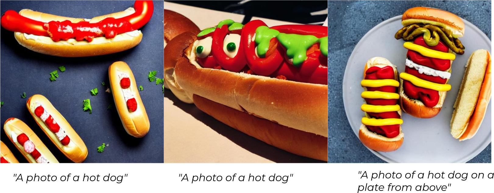
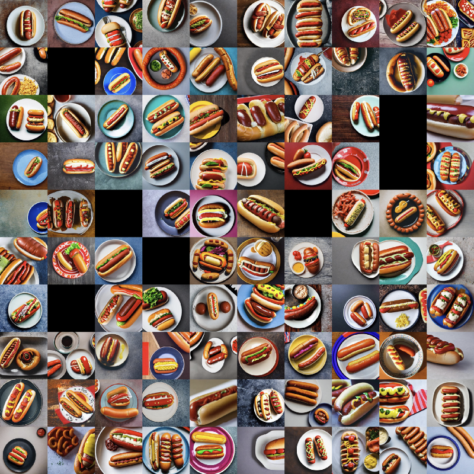
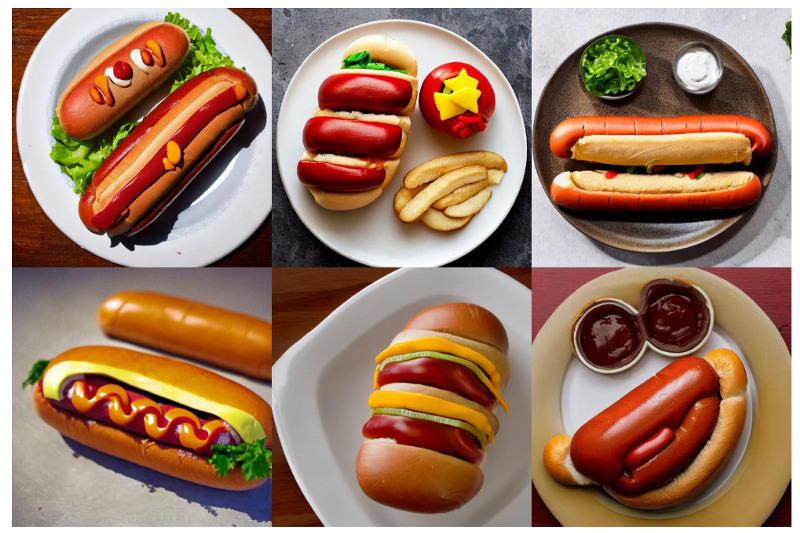
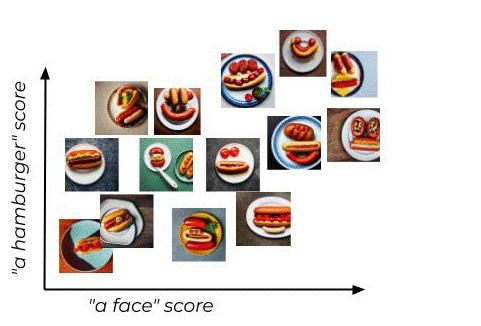

# Combining stable diffusion with semantic search to tag and query images at scale

There has been an incredible advancement in image generation recently. One of the latest examples of this is [Stable Diffusion](https://github.com/CompVis/stable-diffusion#diffusers-integration). You provide a natural language prompt - *"A photo of a hot dog"* - and out comes a high fidelity image matching the caption . Given this great technological development, I decided to generate 100,000 images of hot dogs so you don't have to (the full code for this article is [here](https://github.com/marqo-ai/marqo/blob/mainline/examples/StableDiffusion/hot-dog-100k.py) and the dataset [here](https://drive.google.com/file/d/16_1MlX9GH-6v060jYA23eTJwH74fSU4L/view?usp=sharing)).

<p align="center">
  
</p>


## The hot-dog 100k dataset
I was pretty interested to see what the model could produce given the same prompt, particularly across a large number of images. I used Huggingface [diffusers library](https://github.com/huggingface/diffusers) to [set up the generation](https://github.com/CompVis/stable-diffusion#diffusers-integration) and just let it run. My original plan of 1 million hot-dogs in a day quickly unraveled as I soon realized the required 695 hot-dogs/minute would be unattainable so I had to settle for 13 hot-dogs/minute and ~93,000 (only 7,000 off) images.

<p align="center">
  
</p>


Here is a sample of 100 images randomly selected. There is a pretty wide variety of dogs that are generated and some very interesting interpretations of what constitutes a hot dog.

## Indexing the hot-dog 100k dataset

To dig a bit deeper into hot dog-100k dataset, we can index the data using [Marqo](https://github.com/marqo-ai/marqo). This allows us to easily search the images and do some additional labeling and classifying of the images in the dataset. After downloading the dataset we start up Marqo:

```
pip install marqo
docker pull marqoai/marqo:latest;
docker run --name marqo -it -p 8882:8882 --add-host host.docker.internal:host-gateway marqoai/marqo:latest
```

Once Marqo is up and running we can get the files ready for indexing:

```python
import glob
import os
from marqo import Client

# this should be where the images are unzipped
images_directory = 'hot-dog-100k/'

# the images are accessed via docker from here - you will be able 
# to access them at something like http://[::]:8000/ or http://localhost:8000/ 
docker_path = 'http://host.docker.internal:8222/'

# we start an image server for easier access from within docker
pid = subprocess.Popen(['python3', '-m', 'http.server', '8222', '--directory', images_directory], stdout=subprocess.DEVNULL, stderr=subprocess.STDOUT)

# now find all the files
files = glob.glob(images_directory + "/*.jpg")

# we want to map the filename only with its docker path
files_map = {os.path.basename(f):f for f in files}

# update them to use the correct path
files_docker = [f.replace(images_directory, docker_path) for f in files]

# now we create our documents for indexing -  a list of python dicts
documents = [{"image_docker":file_docker, '_id':os.path.basename(file_docker)} for file_docker,file_local in zip(files_docker, files)]

```

Now we can start indexing:

```python
settings = {
           "model":'open_clip/ViT-B-32/laion2b_s34b_b79k',
           "treatUrlsAndPointersAsImages": True,
           }
client.create_index("hot-dogs-100k", **settings)
responses = client.index("hot-dogs-100k").add_documents(documents, device="cuda", client_batch_size=50, tensor_fields=["image_docker"])

```
Check we have our images in the index:

```python
print(client.index("hot-dogs-100k").get_stats())
```

## Cleaning the hot-dog 100k dataset

One noticeable thing is the presence of some black images. These are caused by the built-in filtering that suppresses images which may be deemed NSFW. I couldn't be bothered to remove the filter so we have some of these images in the dataset. We can easily remove these though using Marqo.  Since I am lazy I will just search for a blank image using a natural language description - *"a black image"*.

```python
results = client.index("hot-dogs-100k").search("a black image")

```
<p align="center">
  
</p>


Now we have a black image, we can search using that and find all the other duplicate black images and remove them from the dataset.

```python
query = 'a black image'

results = client.index(index_name).search(query)

# remove the blank images
results = client.index(index_name).search(results['hits'][0]['image_docker'], limit=100)

# we check the results - scores of very close to 1 are duplicated (this value can change depending on the task)
documents_delete = [r['_id'] for r in results['hits'] if r['_score'] > 0.99999]

client.index(index_name).delete_documents(documents_delete)
```

Now our dataset should be free from images that do not contain hot dogs.

## Labeling the hot-dog 100k dataset

Given the variety of hot dogs generated from a single prompt, I was keen to understand more. A quick search of the following query - *"two hot dogs"* yielded something of interest but more was to follow, *"a hamburger"* and *"a face"*.

```python
results = client.index("hot-dogs-100k").search("a face")
```
<p align="center">
  
</p>


Armed with this survey, I created a new index with the following four documents - *"one hot dog"*, *"two hot dogs"*, *"a hamburger"* and *"a face"*. We can use our dataset images as queries against these labels and get back scores for each. This is effectively doing [zero-shot learning](https://en.wikipedia.org/wiki/Zero-shot_learning) to provide a score for each category which could be thresholded to provide classification labels to each image.

```python
index_name = 'one_dog_two'

# the documents here are actually serving as labels. the documents (i.e. label)
# are returned in the order they most closely match and the score can be used for classification
labels = [{"label":"one hot dog"}, {"label":"two hot dogs"}, 
                {"label":"a hamburger"}, {"label": "a face"}]

# get a copy of the labels only
label_strings = [list(a.values())[0] for a in labels]

# we create a new index
settings = {
        "model":'open_clip/ViT-B-32/laion2b_s34b_b79k',
        "treatUrlsAndPointersAsImages": True,
        }
client.create_index(index_name, **settings)

# add our labels to the index
responses = client.index(index_name).add_documents(labels, tensor_fields=["label"])

# loop through the documents and search against the labels to get scores
for doc in documents:

    # the url for the image is what is used as the search - an image
    # note: you will want a gpu to index the whole dataset device="cuda"
    responses = client.index(index_name).search(doc['image_docker'], device='cpu')

    # now retrieve the score for each label and add it to our document
    for lab in label_strings:
        doc[lab.replace(' ','_')] = [r['_score'] for r in responses['hits'] if r['label'] == lab][0]

```

Now for each image we have the computed scores against each category which were just "documents" in our small index.

## Updating the hot-dog 100k dataset

We have now calculated scores for the different categories described previously. The next thing to do is update our indexed data to have the scores. If we re-index a document it will update it with any new information. We can remove our image field from the documents as it has already been indexed with a model previously.

```python
documents_image_docker = [doc.pop('image_docker') for doc in documents]
responses = client.index("hot-dogs-100k").add_documents(documents, device='cpu', client_batch_size=50, tensor_fields=["image_docker"])
```

## Animating the hot-dog 100k dataset

After all this work we can now animate the hot-dog-100k. We will do this by effectively "sorting" the vectors and creating a movie from these vectors accompanying images. Before we animate, we can make it more interesting as well by restricting the images we can search over by prefiltering on some of the scores we previously calculated. This effectively restricts the space we can use for the animation based on the filtering criteria.

<p align="center">
  
</p>

To animate the images based on their sorted vectors we can take an image as a start point (based on the query "a photo of a smiling face") and find the next closest one (as seen above). Repeat the process until no more images are left and you have walked across the [latent space](https://en.wikipedia.org/wiki/Latent_space). We are effectively solving a variant of the [traveling salesmen problem](https://en.wikipedia.org/wiki/Travelling_salesman_problem) - albeit with an approximate algorithm.

```python
# pick one to start
results = client.index("hot-dogs-100k").search('a photo of a smiling face', 
                      searchable_attributes=['image_docker'], filter_string="a_face:[0.58 TO 0.99]")
# find the document that matches closest with the query
index = [ind for ind,doc in enumerate(documents) if doc['_id'] == results['hits'][0]['_id'] ][0]
current_document = documents[index]
# create a list to store the "sorted" documents
ordered_documents = [current_document['_id']]

for i in range(len(documents)):

    # remove current document
    client.index(index_name).delete_documents([current_document['_id']])

    # now search with it to get next best
    results = client.index(index_name).search(current_document['image_docker'], filter_string="a_face:[0.58 TO 0.99]",
                            searchabel_attributes=['image_docker'], device='cuda')

    next_document = results['hits'][0]

    # now add it
    ordered_documents.append(next_document['_id'])

    current_document = next_document

ordered_images = [files_map[f] for f in ordered_documents]
```

After we have done this walk we have the "sorted" list of images. These can then be animated in the order they appear in the list.

<p align="center">
  
</p>

## Closing thoughts
Its amazing to watch the progress in image generation and the multi-modality of it all. The fidelity of the images is incredible and the ability to maniuplate images via prompt engineering is very interesting. Of particular interest is  how this will impact search given their shared models. If you are interested in this check out [Marqo](https://github.com/marqo-ai/marqo) for yourself and [sign up](https://q78175g1wwa.typeform.com/to/d0PEuRPC) for the cloud beta.
